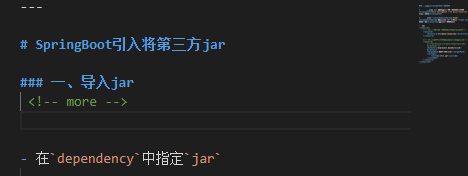

### 生成新的文章

- -p：表示path 路径

- hexo/hexo：表示在`_posts`目录下生成 `hexo/hexo.md`文件（有一层文件夹）

```
hexo new page -p hexo/hexo
```

### 设置文章摘要

​	在内容中插入一行

```bash
 <!-- more -->
```



​	效果如下

​	

### 生成本地生成静态文件：`hexo g`

### 将本地静态文件推送至Github：`hexo d`

### 在文章中使用图片

- 在hexo根目录配置文件`_config.yml`设置属性

  ```
   post_asset_folder:true
  ```

- 在hexo的目录下执行

  ```
  npm install https://github.com/CodeFalling/hexo-asset-image --save   
  ```

- 使用图片

  ```
  
  ```
 
  