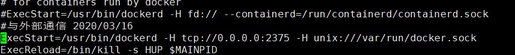

# centos7上安装Docker

1. Docker 要求 CentOS 系统的内核版本高于 3.10，通过 **uname -r** 命令查看当前系统的内核版本

   ```bash
   [root@localhost ~]# uname -r
   3.10.0-1062.9.1.el7.x86_64xxxxxxxxxx [root@localhost ~]# uname -r3.10.0-1062.9.1.el7.x86_64uname -rbash
   ```

2. 将yum包更新到最新

   ```bash
   sudo yum update
   ```

3.  安装需要的软件包， yum-util 提供yum-config-manager功能，另外两个是devicemapper驱动依赖的 

   ```bash
   sudo yum install -y yum-utils device-mapper-persistent-data lvm2
   ```

4. 设置yum源，这里选择阿里仓库

   ```bash
   yum-config-manager --add-repo http://mirrors.aliyun.com/docker-ce/linux/centos/docker-ce.repo
   ```

5. 可以查看仓库中所有docker版本，并选择所需要的安装

   ```bash
   yum list docker-ce --showduplicates | sort -r
   ```

6. 安装docker, 可根据 `sudo yum install <FQPN>`选择版本，例如：sudo yum install docker-ce-17.12.0.ce

   ```bash
   sudo yum install docker-ce
   ```

7. 启动docker

   ```bash
   systemctl start docker
   ```

8. 查看docker是否安装成功

   ```bash
   [root@localhost ~]# docker version
   Client: Docker Engine - Community
    Version:           19.03.8
    API version:       1.40
    Go version:        go1.12.17
    Git commit:        afacb8b
    Built:             Wed Mar 11 01:27:04 2020
    OS/Arch:           linux/amd64
    Experimental:      false
   
   Server: Docker Engine - Community
    Engine:
     Version:          19.03.8
     API version:      1.40 (minimum version 1.12)
     Go version:       go1.12.17
     Git commit:       afacb8b
     Built:            Wed Mar 11 01:25:42 2020
     OS/Arch:          linux/amd64
     Experimental:     false
    containerd:
     Version:          1.2.13
     GitCommit:        7ad184331fa3e55e52b890ea95e65ba581ae3429
    runc:
     Version:          1.0.0-rc10
     GitCommit:        dc9208a3303feef5b3839f4323d9beb36df0a9dd
    docker-init:
     Version:          0.18.0
     GitCommit:        fec3683
   ```

   

# 树莓派上安装Dcoker

1. 树莓派也需要查看版本

   ```bash
   lsb_release -a
   ```

     这里一般分 `buster`和`stretch `版，我的是`stretch `，版本，所以接下来很多操作都关系这个，一定要注意。

2. 编辑sources.list文件

   ```bash
   sudo vim /etc/apt/sources.list
   ```

   ```bash
   deb http://mirrors.tuna.tsinghua.edu.cn/raspbian/raspbian/ stretch main contrib non-free rpi
   deb-src http://mirrors.tuna.tsinghua.edu.cn/raspbian/raspbian/ stretch main contrib non-free rpi
   ```

   修改镜像源，改成国内的,这里需要根据版本选择，如果是上面说的`stretch `版本，那就使用上面配置，如果是`buster`，就是用下面这种

   ```bash
   deb http://mirrors.tuna.tsinghua.edu.cn/raspbian/raspbian/ stretch main contrib non-free rpi
   deb-src http://mirrors.tuna.tsinghua.edu.cn/raspbian/raspbian/ stretch main contrib non-free rpi
   ```

3. 修改raspi.list文件

   ```bash
   sudo vim  /etc/apt/sources.list.d/raspi.list
   ```

   将其它内容注释，添加如下，同样，`如果是buster `版本，需要将 `stretch`进行替换  

   ```
   deb http://mirror.tuna.tsinghua.edu.cn/raspberrypi/ stretch main ui
   deb-src http://mirror.tuna.tsinghua.edu.cn/raspberrypi/ stretch main ui
   ```

4. 更新验证

   ```bash
   sudo apt-get update
   ```

5. 安装HTTPS所依赖的包

   ```bash
   sudo apt-get install \
        apt-transport-https \
        ca-certificates \
        curl \
        gnupg2 \
        software-properties-common
   
   ```

6. 添加 `Docker` 的`GPG key`

   ```bash
   curl -fsSL https://download.docker.com/linux/debian/gpg | sudo apt-key add -
   ```

   验证`Key id`

   ```bash
   sudo apt-key fingerprint 0EBFCD88
   ```

7. 根据系统版本设置`Docker`源

   ```bash
   echo "deb [arch=armhf] https://download.docker.com/linux/debian \
        $(lsb_release -cs) stable" | \
        sudo tee /etc/apt/sources.list.d/docker.list
   
   ```

8. 安装

   ```bash
   sudo apt-get update
   sudo apt-get install docker-ce
   ```

9. 添加`Docker`用户组

   ```bash
   sudo groupadd docker
   sudo gpasswd -a ${USER} dockersudo service docker restart
   ```

10. 启动验证

    ```bash
    sudo systemctl start docker
    sudo docker version
    pi@raspberrypi:/root $ sudo docker version
Client: Docker Engine - Community
     Version:           19.03.8
     API version:       1.40
     Go version:        go1.12.17
     Git commit:        afacb8b
     Built:             Wed Mar 11 01:37:36 2020
     OS/Arch:           linux/arm
     Experimental:      false
    
    Server: Docker Engine - Community
     Engine:
      Version:          19.03.8
      API version:      1.40 (minimum version 1.12)
      Go version:       go1.12.17
      Git commit:       afacb8b
      Built:            Wed Mar 11 01:31:37 2020
      OS/Arch:          linux/arm
      Experimental:     false
     containerd:
      Version:          1.2.13
      GitCommit:        7ad184331fa3e55e52b890ea95e65ba581ae3429
     runc:
      Version:          1.0.0-rc10
      GitCommit:        dc9208a3303feef5b3839f4323d9beb36df0a9dd
     docker-init:
      Version:          0.18.0
      GitCommit:        fec3683
    ```
    

# Docker安装完后的配置

1. ##### 镜像源问题

   1. Docker安装完之后，拉取源是非常缓慢的，因为默认源是在国外。。。可以通过配置国内的镜像源，这里使用的是网易镜像地址

   2. 编辑文件

      ```bash
      vim /etc/docker/daemon.json
      ```

   3. 添加参数（如果没有该文件，可以直接新建）

      ```bash
      {
        "registry-mirrors": ["http://hub-mirror.c.163.com"]
      }
      ```

   4. 重启

      ```bash
      systemctl restart docker
      ```

      重启后可以尝试拉去镜像，比如 `docker pull jenkins/jenkins`

2. ##### Docker远程通信

   1. 编辑文件

      ```bash
      vim /lib/systemd/system/docker.service
      ```

   2. 修改配置，在`ExecStart`之后添加配置`ExecStart=/usr/bin/dockerd -H tcp://0.0.0.0:2375 -H unix:///var/run/docker.sock`

      

