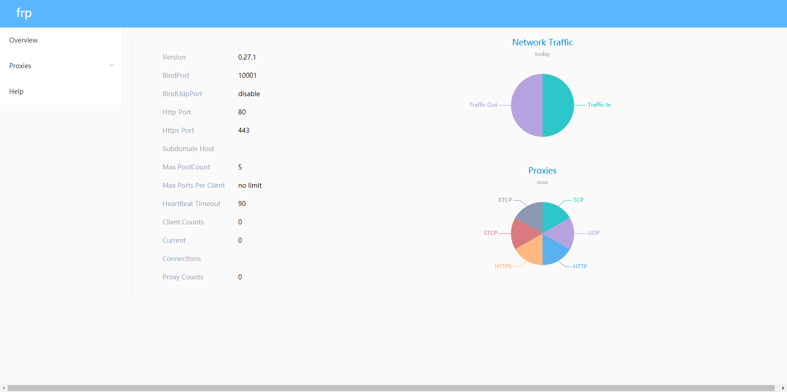

之前很无聊买了个树莓派，一直吃灰，然后刚好谷歌云免费一年使用，于是打算拿来做服务器，并且可以随时通过外网访问，这就要使用到内网穿透服务了，这里通过frp穿透进行代理。


## 配置工具

1. 谷歌云服务器 `centos7`
2. 树莓派`Debian`
3. 连接工具`xshell`

## 云服务器配置

在一台刚创建的服务器上下载`frp`，使用`xshell`登录云服务器，在[github]( https://github.com/fatedier/frp/releases )中找到系统所对应版本, 这里使用 `frp_0.27.1_linux_amd64.tar.gz`

1. 下载

   ```
   wget https://github.com/fatedier/frp/releases/download/v0.27.1/frp_0.27.1_linux_amd64.tar.gz
   #提示 -bash: wget: command not found
   yum install wget -y
   ```

2. 解压

   ```
   tar -zxvf frp_0.27.1_linux_amd64.tar.gz
   ```

3. 修改名称

   ```
   mv frp_0.27.1_linux_amd64 frp
   ```

4. 进入文件夹，删除不需要文件

   ```
   cd frp
   rm -f frpc*
   ```

5. 配置`frps.ini`

   ```
   vim frps.ini
   ```

   

   ```
   #配置文件
   [common]
   bind_addr = 0.0.0.0				#穿透监听端口与地址(0.0.0.0表示允许任何地址)
   bind_port = 10001
   protocol = tcp
   
   token = a123					# 客户端连接令牌
   vhost_http_port = 80			#虚拟主机穿透监听端口(指http与https的访问端口)
   vhost_https_port = 443
   
   log_file = /opt/frp/frps.log	# frp日志记录路径
   log_level = info				# 日志记录级别(trace, debug, info, warn, error)
   log_max_days = 3				# 日志记录滚动天数
   
   dashboard_addr = 0.0.0.0		#服务端控制面板访问端口
   dashboard_port = 10002
   dashboard_user = USER			# 服务端控制面板访问账号和密码，不设置则默认admin
   dashboard_pwd = PASSWD
   
   tcp_mux = true					# tcp流多路复用(可以理解为优化传输) 
   
   ```

6. ​	启动

   ```
   ./frps -c ./frps.ini
   ```

7. 启动成功，可登录服务器地址:`10002`，访问控制面板

      

## 树莓派配置

由于树莓派是`arm架构`,(如何查看`linux`架构，可通过`uname -a`命令查看)，所以需要使用`frp_0.27.1_linux_arm64.tar.gz`版本

1. 下载(或者通过`ftp`工具传输)

   ```
   wget https://github.com/fatedier/frp/releases/download/v0.27.1/frp_0.27.1_linux_arm.tar.gz
   ```

2. 解压、修改名称、删除不需要文件

   ```
   tar -zxvf frp_0.27.1_linux_arm.tar.gz
   mv frp_0.27.1_linux_arm frp
   cd frp
   rm -f frps*
   ```

3. 配置`frpc.ini`

   ```
   vim frpc.ini
   ```

   ```
   [common]
   server_addr = ********  服务器地址
   server_port = 10001
   token=a123
   
   # 日志记录路径
   log_file = ./frpc.log
   # 日志记录级别(trace, debug, info, warn, error)
   log_level = info
   # 日志记录滚动天数
   log_max_days = 3
   
   
   # frpc客户端管理界面
   admin_addr = 127.0.0.1
   admin_port = 7400
   admin_user = admin
   admin_passwd = passwd
   
   [ssh]
   type = tcp
   local_ip = 127.0.0.1
   local_port = 22
   remote_port = 22315
   
   
   #http或者https模式主要针对于虚拟主机，访问的取决于frps.ini文件中的vhost_http_port设置
   [web01]
   type = http
   local_ip = 127.0.0.1
   local_port = 80
   custom_domains = cksspk.com			#域名
   http_user = admin
   http_pwd = passwd
   ```

4. 启动 34.94.17.49

   ```
   ./frpc -c ./frpc.ini
   ```

5. 验证

   可通过`xshell`新建会话，输入 `谷歌云IP`地址，加上 `frpc.ini`文件中 `remote_port = 22315`端口，连接即可

## 后台启动

通过上面的方式启动会占用当前shell, 一般会通过使用`systemctl`来控制启动

### 谷歌云配置

```
vim /lib/systemd/system/frps.service
```

```
[Unit]
Description=Frp Server Service
After=network.target

[Service]
Type=simple
ExecReload=/bin/kill -s HUP $MAINPID
ExecStop=/bin/kill -s QUIT $MAINPID
ExecStart=/opt/frp/frps -c /opt/frp/frps.ini	# "ExecStart="之后的路径要填写你的frps安装路径

[Install]
WantedBy=multi-user.target

```

### 树莓派配置

```
vim /lib/systemd/system/frpc.service
```

```
[Unit]
Description=Frp Client Service
After=network.target

[Service]
ExecStart=/opt/frp/frpc -c /opt/frp/frpc.ini # "ExecStart="之后的路径要填写你的frps安装路径
ExecStop=/bin/kill $MAINPID

[Install]
WantedBy=multi-user.target
```

### `systemctl`相关命令

1. 启动

   ```
   systemctl start frps.service
   ```

2. 查看状态

   ```
   systemctl status frps.service
   ```

3. 停止

   ```
   systemctl stop frps.service
   ```

4. 开机自启

   ```
   systemctl enable frps.service
   ```

5. 停止开机自启

   ```
   systemctl disable frps.service
   ```

   