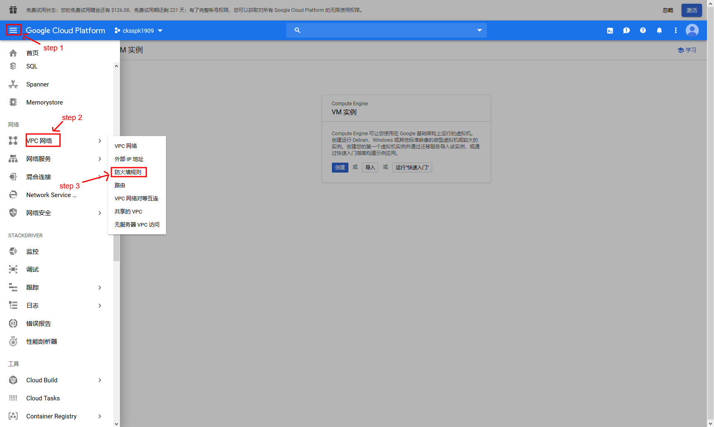
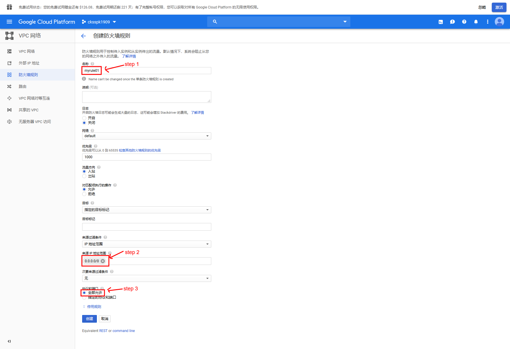
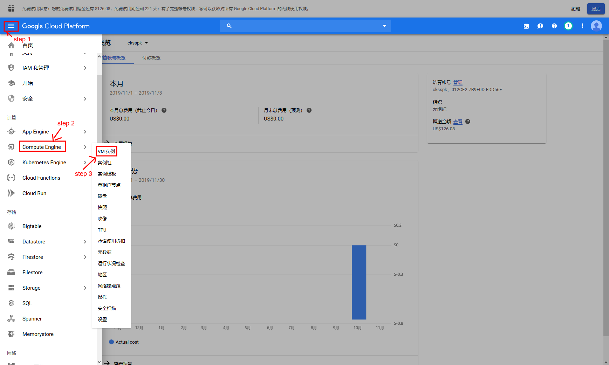
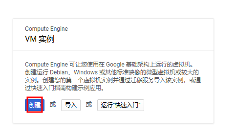
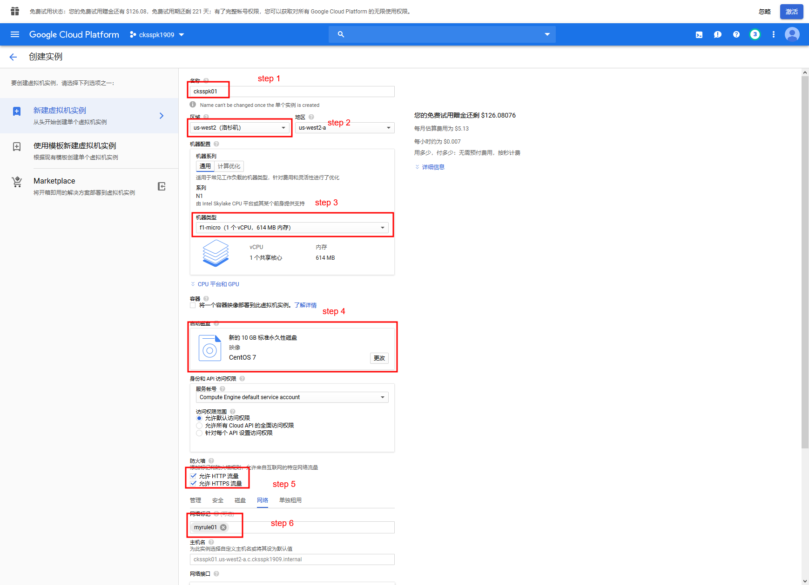

##   官方首页

1. 浏览器进入[谷歌云地址](https://cloud.google.com/)
2. 登陆账号
3. 点击`转到控制台`

## 创建防火墙规则

1. 点击左上角打开侧边栏

2. 鼠标移至`VPC网络`

3. 在展开的二级菜单中点击`防火墙规则`

   1. 

4. 点击`创建防火墙`

5. 名称随便输入 比如:  `myrule01`

6. 目标选择 `网络中所有实例`（这个截图漏掉了）

7. 来源IP地址范围  `0.0.0.0/0`

8. 协议和端口选择 `全部允许`
    

## 创建VM实例

1. 点击左上角打开侧边栏

2. 鼠标移至`Compute Engine`

3. 在展开的二级菜单中点击`VM实例`

   1. 

4. 点击`创建`

   

5. 名称输入： `cksspk01`

6. 区域选择： `洛杉矶` 地区随意

7. 机器配置：`f1-micro(1个vCPU, 614MB内存)`

8. 启动磁盘：`centos 7`

9. 防火墙：`允许HTTP/HTTPS流量`

10. 点开配置，在*网络*选项 `网络标记`选择刚才创建的规则

11. 点击`创建`

    

## 连接

工具：`Xshell`

1. 本地用xshell生成密钥匙
2. 将密钥匙配置到谷歌云上