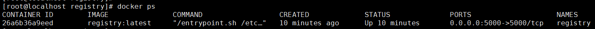
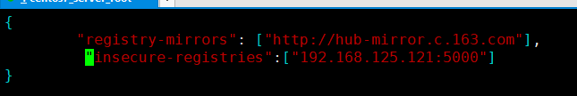
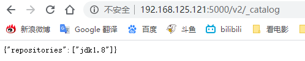

# 一、搭建私服

​	*自己制作的镜像一般会上传到本地私服，首先得搭建一个docker私有仓库服务，docker的私服搭建也是非常简单*

1. #### 拉取私有仓库镜像

   ```bash
   docker pull registry
   ```

2. #### 启动 `registry`仓库容器

   ```
   docker run -d --restart=always --privileged=true \
   -p 5000:5000 \
   -v /usr/local/docker/data/registry:/var/lib/registry \
   --name registry registry:latest
   ```

   参数说明，启动参数有一定顺序，可能会因为顺序不同而启动失败

   > –restart=always 此模式容器会跟 docker daemon会随着docker服务的重启而自动恢复
   > -v /usr/local/docker/data/registry 把本地磁盘挂载到容器磁盘/var/lib/registry（默认情况下仓库存放镜像于容器内的/var/lib/registry目录下，宿主机目录需要提前创建）
   > –name registry定义容器名
   > -p 5000:5000 端口映射，本地端口5000映射到容器端口5000
   > –-privileged=true ：配置了-v /opt/data/registry:/var/lib/registry ，如果没有关闭安全模块selinux，容器将没有权限访问本地目录，设置此参数可以给容器加特权。如果没有关闭selinux以及没有加上此参数，上传传镜像时可能会报权限错误(OSError: [Errno 13] Permission denied: ‘/var/lib/registry/repositories/library’)或者（Received unexpected HTTP status: 500 Internal Server Error）错误

3. #### 启动成功后通过`docker ps`查看

   ```bash
   docker ps
   ```

   

4. #### 测试镜像仓库中所有的镜像

   ```bash
    curl http://127.0.0.1:5000/v2/_catalog
    {"repositories":[]}
   ```

    现在是空的，因为才刚运行，里面没有任何镜像内容。 

   #### 问题

   启动docker容器时报错

   ```bash
   iptables failed: iptables --wait -t nat -A DOCKER -p tcp -d 0/0 --dport 5000 -j DNAT --to-destination 172.18.0.4:5000 ! -i br-ff45d935188b: iptables: No chain/target/match by that name. (exit status 1)
   ```

   解决方案：**重启docker**

   ```bash
   systemctl restart docker
   ```

# 二、上传镜像至私服

1. #### 首先添加可信任仓库

   ```ba
   # 编辑文件
   vim /etc/docker/daemon.json
   # 添加仓库配置 192.168.125.121:5000为宿主机地址加私服启动端口
   "insecure-registries":["192.168.125.121:5000"]
   ```

   

2. #### 更新配置

   ```bash
    systemctl daemon-reload
   ```

3. #### 重新启动`docker`

   ```bash
   systemctl restart docker
   ```

4. #### 给原有镜像打标签

   ```
    docker tag jdk1.8 192.168.125.121:5000/jdk1.8
   ```

5. #### 上传到私有仓库

   ```
    docker push jdk1.8 192.168.125.121:5000/jdk1.8
   ```

6. #### 可以通过浏览器访问查看仓库

   ```
   http://192.168.125.121:5000/v2/_catalog
   ```

   

   其中仓库中出现 jdk1.8这个镜像。