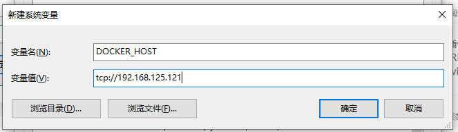

# 通过maven插件构建Docker镜像上传私服

​	*在持续集成过程中，项目工程 一般使用Maven编译打包，然后生成镜像，通过镜像上线， 能够大大提供上线效率，同时能够快速动态扩容，快速回滚，着实很方便。docker-maven-plugin 插件就是为了帮助我们在Maven工程中，通过简单的配置，自动生成镜像并推送到仓库中。*

### 	宿主机配置

#### 	1. 首先在Docker宿主机中配置可通过远程访问，基于centos7系统

```bash
# 打开编辑文件
vim /usr/lib/systemd/system/docker.service
```

在 ExecStart=/usr/bin/dockerd的后面加上`-H tcp://0.0.0.0:2375 -H unix:///var/run/docker.sock` 


```
:wq保存退出
```

#### 2. 重启**Docker**守护进程，重启Docker

```bash
systemctl daemon-reload  
systemctl start docker  
```

- 在宿主机输入 `**netstat -anp|grep 2375**` 查看监听端口

- 在浏览器输入 **192.168.125.121:2375/info** 显示数据，表明端口一对外开放

  

#### 3. registry私服仓库启动

### 	主机配置（win10）

- 一种是在电脑的环境变量种配置tcp

  

- 一种是通过**DockerHost**配置

  

这里采用第二种方式，具体pom文件如下

```xml
<build>
        <!--启动名称-->
        <finalName>app</finalName>
        <plugins>
            <plugin>
                <groupId>org.springframework.boot</groupId>
                <artifactId>spring-boot-maven-plugin</artifactId>
            </plugin>
            <!--docker的maven插件-->
                <plugin>
                    <groupId>com.spotify</groupId>
                    <artifactId>docker-maven-plugin</artifactId>
                    <version>1.0.0</version>
                    <!--<version>1.0.0</version>-->
                    <configuration>
                        <!--基础镜像的名称-->
                        <baseImage>jdk1.8</baseImage>
                        <!--生成的镜像名称-->
                        <imageName>192.168.125.121:5000/${project.artifactId}:${project.version}</imageName>
                        <!--相当于启动容器后自动执行java -jar命令-->
                        <entryPoint>["java", "-jar", "/${project.build.finalName}.jar"]</entryPoint>
                        <resources>
                            <resource>
                                <targetPath>/</targetPath>
                                <directory>${project.build.directory}</directory>
                                <include>${project.build.finalName}.jar</include>
                            </resource>
                        </resources>
                        <dockerHost>http://192.168.125.121:2375</dockerHost>
                    </configuration>
                </plugin>
            </plugins>
    </build>
```

#### 打包上传

- 这里使用了一个简单的**springboot**工程，提供/hello接口

  

- 在**idea**中打开**Terminal**命令窗口，进入要打包的工程目录下

  ```powershell
  mvn install
  ```

- 打包完成之后，进行docker镜像制作和上传

  ```bash
  mvn docker:build -DpushImage
  ```
  
  ```powershell
  Step 1/3 : FROM jdk1.8
  
   ---> 9962dfc8b892
  Step 2/3 : ADD /app1.jar //
  
   ---> c3859ca47b38
  Step 3/3 : ENTRYPOINT ["java", "-jar", "/app1.jar"]
  
   ---> Running in ed0ab6e3574f
  Removing intermediate container ed0ab6e3574f
   ---> 00e704f305bc
  ProgressMessage{id=null, status=null, stream=null, error=null, progress=null, progressDetail=null}
  Successfully built 00e704f305bc
  Successfully tagged 192.168.125.121:5000/ckssblog:1.0
  [INFO] Built 192.168.125.121:5000/ckssblog:1.0
  [INFO] Pushing 192.168.125.121:5000/ckssblog:1.0
  The push refers to repository [192.168.125.121:5000/ckssblog]
  33dca580002a: Pushed
  851f2b8709b8: Layer already exists
  5c2a28ad5134: Layer already exists
  0683de282177: Layer already exists
  1.0: digest: sha256:49783be4a9117124457b53b08f076183fde33fe62571051e08effa688db18a2d size: 1161
  null: null
  [INFO] ------------------------------------------------------------------------
  [INFO] BUILD SUCCESS
  [INFO] ------------------------------------------------------------------------
  [INFO] Total time:  13.995 s
  [INFO] Finished at: 2020-03-19T19:34:35+08:00
  [INFO] ------------------------------------------------------------------------
  ```
  
  > <u>maven执行命令</u>
  >
  > **mvn clean package docker:build** 只执行 build 操作
  >
  > **mvn clean package docker:build -DpushImage** 执行 build 完成后 push 镜像
  >
  > **mvn clean package docker:build -DpushImageTag** 执行 build 并 push 指定 tag 的镜像
  >
  > 注意：这里必须指定至少一个 imageTag，它可以配置到 POM 中，也可以在命令行指定。命令行指定如下：mvn clean package docker:build -DpushImageTags -DdockerImageTags=imageTag_1 -DdockerImageTags=imageTag_2，POM 文件中指定配置如下：
  >
  > ```xml
  > <build>
  > <plugins>
  >  ...
  >  <plugin>
  >    <configuration>
  >      ...
  >      <imageTags>
  >         <imageTag>imageTag_1</imageTag>
  >         <imageTag>imageTag_2</imageTag>
  >      </imageTags>
  >    </configuration>
  >  </plugin>
  >  ...
  > </plugins>
  > </build>
  > ```
  >
  > 

#### 验证查看

-  切换到宿主机，查看docker镜像和镜像仓库

  ```bash
  docker images
  ```

  

  	可以看到docker中已经有该镜像**192.168.125.121:5000/ckssblog**

- 在地址栏输入 **http://192.168.125.121:5000/v2/_catalog** ，镜像仓库中也有新上传的镜像

  

- 通过镜像启动容器

  ```bash
  docker run -di --name=base -p 8099:8080 192.168.125.121:5000/ckssblog:1.0
  ```

  

- 打开浏览器地址，输入 **http://192.168.125.121:8099/hello** 

  