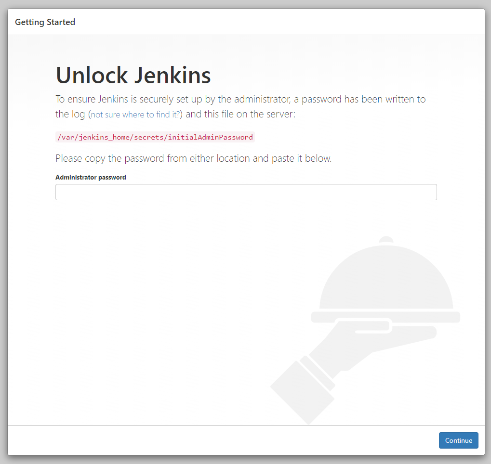
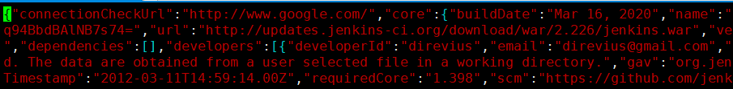

# Jenkins安装启动

*Jenkin安装启动方式有很多种，比如下载`war`包后放在`tomcat`中启动、使用`rpm`安装、或者使用`Docker`安装，这里先使用Docker进行安装。*

## Docker安装Jenkin

1. ### 查看版本

   ```bash
   docker search jenkins
   ```

   ```
[root@localhost opt]# docker search jenkins
   NAME                                   DESCRIPTION                                     STARS               OFFICIAL            AUTOMATED
   jenkins                                Official Jenkins Docker image                   4698                [OK]                
   jenkins/jenkins                        The leading open source automation server       1954                                    
   jenkinsci/blueocean                    https://jenkins.io/projects/blueocean           
   .......
   ```
   
2. ### 默认下载latest版

	 ```bash
   sudo docker pull jenkins/jenkins
   ```

   查看镜像

   ```bash
   sudo docker images
   REPOSITORY          TAG                 IMAGE ID            CREATED             SIZE
   jenkins/jenkins     latest              768d450bf188        2 days ago          619MB
   ```

4. ### 启动Jenkins容器

   ##### 输入jenkins
   
   ```bash
sudo docker run -d -p 8088:8080 -p 50001:50000 -v /usr/local/jenkins:/var/jenkins_home -v /etc/localtime:/etc/localtime --name jenkins docker.io/jenkins/jenkins
   ```

   启动参数说明：	
   
   > -d 后台运行镜像
   > -p 8088:8080 将镜像的8080端口映射到服务器的8088端口
   > -p 50001:50000 将镜像的50000端口映射到服务器的50001端口
   > -v /usr/local/jenkins:/var/jenkins_home /var/jenkins_home目录为（容器）jenkins工作目录，我们将硬盘上的一个目录挂载到这个位置，方便后续更新镜像后继续使用原来的工作目录。
   > -v /etc/localtime:/etc/localtime 让容器使用和服务器同样的时间设置。
   > --name jenkins 给容器起一个别名

   ##### 有可能会启动失败，这里需要对宿主机中的目录设置权限

   ```bash
   sudo chown -R 1000:1000  /usr/local/jenkins
   ```

   ##### 重新运行容器
   
   ```bash
   sudo docker run -d -p 8088:8080 -p 50001:50000 -v /usr/local/jenkins:/var/jenkins_home -v /etc/localtime:/etc/localtime --name jenkins docker.io/jenkins/jenkins
   ```
   
4. #### 查看容器

    ```bash
    sudo docker ps
    ```

    ```
    CONTAINER ID        IMAGE               COMMAND                  CREATED             STATUS              PORTS                                              NAMES
    869de06b4a9d        jenkins/jenkins     "/sbin/tini -- /usr/…"   8 minutes ago       Up 8 minutes        0.0.0.0:8088->8080/tcp, 0.0.0.0:50001->50000/tcp   jenkins
    ```

    成功运行在了8080端口，可登录浏览器访问，前提是宿主机的8080端口需要开放

    

5. ### 配置jenkins

   由于这里使用`Docker`启动的**Jenkins**，所以需要进入容器内部获取初始化密码

   ```bash
   docker exec jenkins tail /var/jenkins_home/secrets/initialAdminPassword
   ```

   获取密码后在页面输入密码，点击**Continue**，进入插件安装界面，可以选择建议安装，也可以自定义安装

   #### 初次启动卡住很慢

   解决方案

   ​	进入Jenkins工作目录，修改./updates/default.json文件， 把 "connectionCheckUrl":"http://www.google.com/" 改为  "connectionCheckUrl":"http://www.baidu.com/" 

   ```
   cd /usr/local/jenkins/updates
   vim default.json
   ```

   

