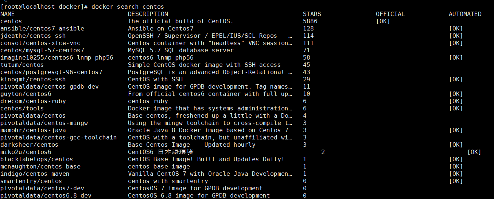
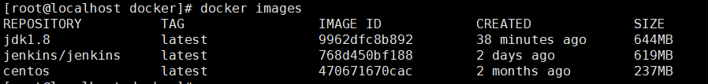
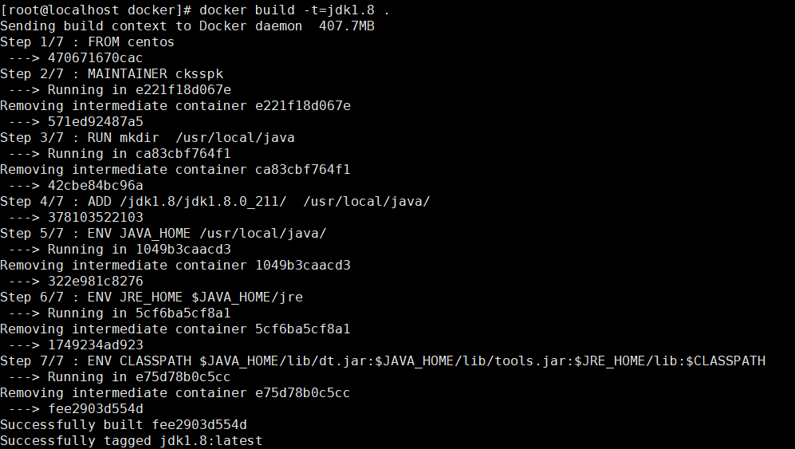
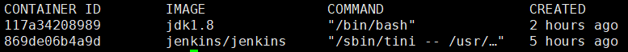

# 一、Docker基础镜像制作

​	使用docker运行java项目需要一个基础镜像，制作java环境基础镜像方式有很多，比如基于**Alpine**、**ubuntu**、**centos**，这里使用centos（比较习惯）

1. 首先查找镜像

   ```bash
   docker search centos
   ```

   

2. 拉取镜像`docker pull centos`，中间下载需要时间，下载完可以通过`docker images`查看

   

3. 创建Dockerfile文件

   ```bash
   # 创建存放Dockerfile的文件夹
   mkdir /usr/local/docker
   # 移动至目标目录
   cd /usr/local/docker
   # 创建jdk存放目录
   mkdir jdk1.8
   # 将jdk的压缩文件解压至该文件夹，或者将原有的复制进来
   cp -r /usr/local/java/jdk1.8.0_211/ ./jdk1.8/
   # 创建Docker文件
   vim Dockerfile
   ```

   Dockerfile文件如下

   ```
   #依赖镜像名称和ID
   FROM centos
   #指定镜像创建者信息
   MAINTAINER cksspk
   #执行命令，在容器中创建目录
   RUN mkdir  /usr/local/java
   #ADD 是相对路径jar,把java添加到容器中
   ADD /jdk1.8/jdk1.8.0_211/  /usr/local/java/
   
   #配置java环境变量
   ENV JAVA_HOME /usr/local/java/
   ENV JRE_HOME $JAVA_HOME/jre
   ENV CLASSPATH $JAVA_HOME/lib/dt.jar:$JAVA_HOME/lib/tools.jar:$JRE_HOME/lib:$CLASSPATH
   ENV PATH $JAVA_HOME/bin:$PATH
   ```

   其中ADD之后的路径一定要注意文件前后都有 //，否则docker找不到会报错

   ```bash
   ADD failed: stat /var/lib/docker/tmp/docker-builder055888630/jdk1.8/jdk1.8.0_211/: no such file or directory
   ```

   保存退出

4. 使用Dockerfile制作镜像

   ```bash
   docker build -t=jdk1.8 .
   ```

   

   制作完成之后可以通过`docker images`查看

   

   如果没有报错，会出现上面第一个镜像，报错的也会有镜像，但是没有名称，这个docker制作的写时复制有关，一层一层传递，可以通过`docker rmi <ID>` 删除镜像

5. 运行检查

   后台运行镜像

   ```bash
   docker run -itd --name jdk8 jdk8
   da7084eaf0e79bc2336980e5ebeecb912dcac3f83b5fbce9fdcb449664d32d8a
   ```

   查看容器状态

   ```bash
   docker ps 
   ```

   

   进入容器，并且查看jdk版本信息

   ```bash
   [root@localhost docker]# docker attach 117a34208989
   [root@117a34208989 /]# java -vresion
   Unrecognized option: -vresion
   Error: Could not create the Java Virtual Machine.
   Error: A fatal exception has occurred. Program will exit.
   [root@117a34208989 /]# java -version
   java version "1.8.0_211"
   ```

   退出容器

   ```bash
   exit
   ```

   至此，基础镜像制作完成。
